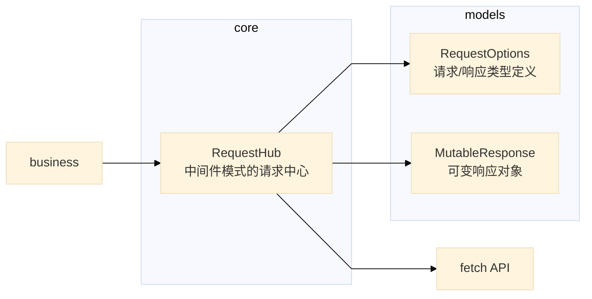
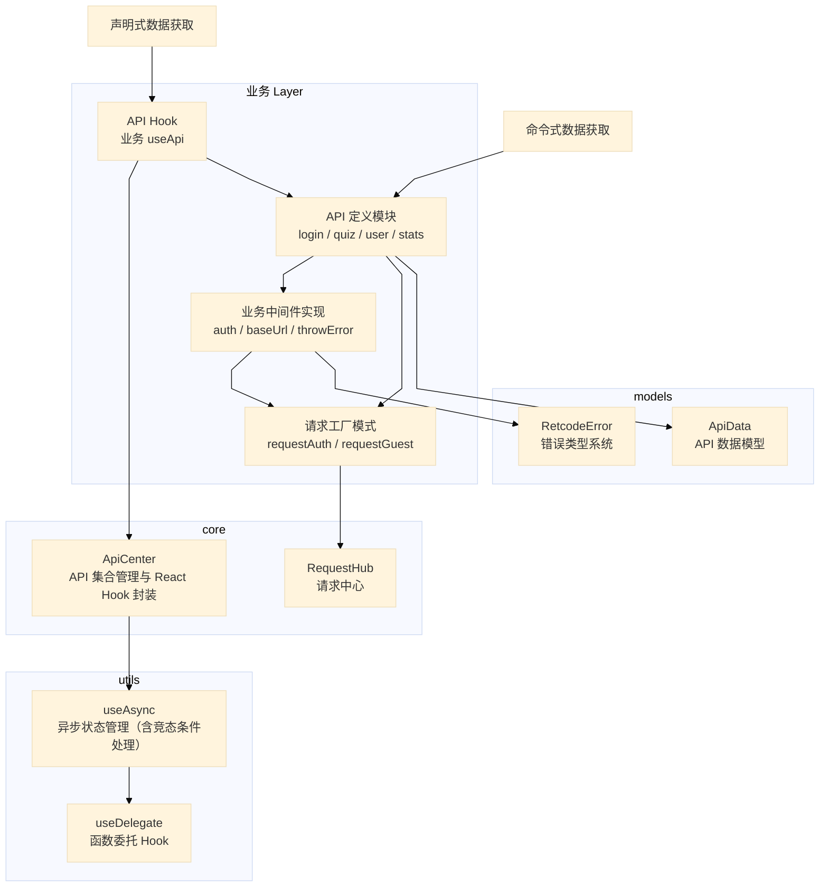
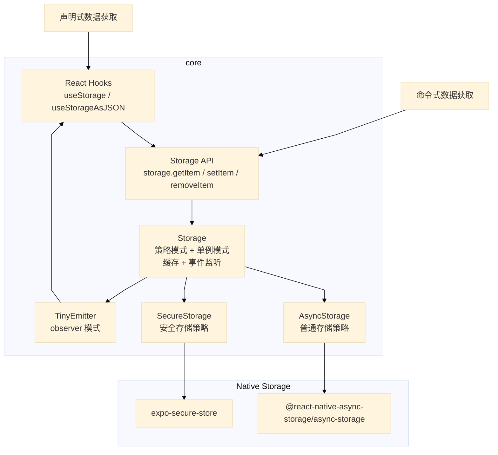
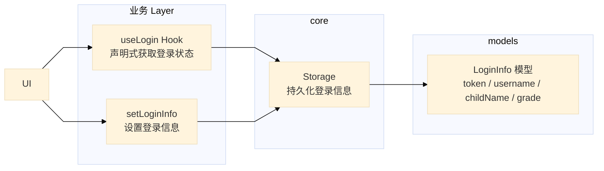

# Math Whiz - 数学学习应用

Math Whiz 是一款面向小学生的数学练习应用，帮助孩子们通过日常练习提高数学能力。应用支持用户注册登录、每日数学练习、错题本管理、学习统计等功能。

## 技术栈

### 开发语言
- `TypeScript` ~5.9.2

### 核心框架
- `React Native` 0.81.5
- `React` 19.1.0
- `Expo` ~54.0.20
- `Expo Router` ~6.0.13

### 数据管理
- `@react-native-async-storage/async-storage`
- `expo-secure-store`
- `immer`

### 国际化
- `i18next` ^25.6.0
- `react-i18next` ^16.2.1
- `js-yaml` ^4.1.0

### 构建工具与包管理器
- `Bun`
- `Expo`
- `eas-cli`
- `JDK` `Android Studio`

## 开始开发

```bash
bun i

# 开发
bun dev

# 构建项目
bunx expo prebuild --clean
bun build
```

## 项目结构

在项目整体架构上，我们遵循了以下原则：

- 需求驱动开发，实现不同业务模块高度收敛。
- 单一职责原则。

```
math-whiz/
├── app/                   # 路由目录
│   ├── (tabs)/
│   │   ├── index.tsx      # 首页（重定向到学习页）
│   │   ├── study.tsx      # 学习页
│   │   └── me.tsx         # 个人中心页
│   ├── auth/
│   │   ├── index.tsx      # 认证入口页
│   │   ├── login.tsx      # 登录页
│   │   └── signup.tsx     # 注册页
│   ├── exercise.tsx       # 练习页面
│   ├── result.tsx         # 结果页面
│   └── wrong-book.tsx     # 错题本页面
├── src/
│   ├── common/            # 通用业务逻辑
│   │   ├── api/           # API 接口
│   │   ├── components/    # 公共组件
│   │   ├── i18n/          # 国际化
│   │   └── interface/     # UI 层业务逻辑
│   ├── core/              # 核心
│   │   ├── functional/    # 功能模块（API hook、异步 hooks 等）
│   │   ├── request/       # 网络请求
│   │   └── storage/       # 存储管理
│   ├── pages/
│   │   ├── auth-view/     # 认证视图
│   │   ├── exercise-view/  # 练习视图
│   │   ├── study-tab-view/ # 学习标签页视图
│   │   └── ...
│   ├── theme/             # 主题配置（深色/浅色）
│   └── locales/           # 多语言文件
├── assets/                # 构建时静态资源
└── package.json           # 项目配置
```

## 细节介绍

### 代码规范

- standard 代码风格检查，从语法层面规避错误
- TypeScript：严格类型检查，确保类型安全
- **代码组织原则**：
  - 函数组件（FC）和 Hooks 优先
  - 单一职责原则
  - 需求驱动开发，业务模块高度收敛

### 国际化

采用 i18next。并为 FC 封装 `useI18n` hook，用于获取翻译文本。

多语言文件位于 `src/locales/` 目录，用 YAML 格式方便编写。运行时会自动生成 JSON 文件，用于在代码中使用。

### 主题系统

装饰器模式，响应性支持深色和浅色主题。在 `src/common/interface/theme.ts` 中封装了两个 hook：

- `useThemedStyles` 对 `StyleSheet.NamedStyles<K>` 的装饰器 hook，用于为不同主题适配不同的样式。
- `usePalette` 用于直接获取主题颜色。

主题配置位于 `src/theme/` 目录。

```tsx
export default function SomeComponent () {
  // 装饰器 hook
  const styles = useThemedStyles(stylesModel)

  return (
    <View style={styles.container} />
  )
}

// 样式模型
const stylesModel = createStylesModel((palette) => ({
  container: {
    backgroundColor: palette.backgroundPrimary,
  },
}))
```

### 网络请求设计模式

网络请求是微内核的。采用 koa-like 的 onion scheme 中间件模式，实现了高度模块化、可扩展和类型安全的网络请求体系。

1. 核心层：负责网络请求的实现，包括请求中心和中间件模式。
2. 数据层：负责包装请求和响应的上下文。

`RequestHub` 是对 fetch API 的封装，提供了业务无关的中介层。在业务场景下，可以通过组合中间件来实现不同的功能。例如，baseUrl 中间件可以为请求添加基础 URL，而 auth 中间件可以为请求添加认证信息，throwError 中间件则是为请求添加符合业务需求的错误规整（不处理错误，而是抛出规范错误）。



### API 接口设计模式

API 基于上文构建的 `requestAuth` / `requestGuest` 两个请求工厂，规范了 API 的接口。除了做命令式数据获取，在绝大部分组件下，还可以通过 `useApi` hook 实现声明式数据获取。

`useApi` hook 基于 `ApiCenter` 的微内核实现，实现了将命令式转换为声明式的数据获取。



### Storage 设计模式

Storage 系统是项目数据持久化管理的核心实现，采用策略模式和单例模式，实现了普通存储和安全存储两种策略，对外统一暴露 `BaseStorage` 的 Facade，通过 options 参数来切换存储策略。这个模块与具体的业务逻辑无关，作为 core 提供的基础设施。

- 普通存储 `AsyncStorage`：基于 `@react-native-async-storage/async-storage`，用于存储非敏感数据
- 安全存储 `SecureStorage`：基于 `expo-secure-store`，用于存储敏感数据（如用户 token、密码等）

有一些特性：

- 内存缓存机制：提供高性能的存储体验，避免频繁读取磁盘
- 响应式更新：通过 observer 模式（基于 `tiny-emitter`）实现存储数据的响应式更新
- 声明式 API：提供 `useStorage` / `useStorageAsJSON` hooks，支持声明式地获取和设置存储数据



### Login 系统

Login 系统是业务层的认证模块，基于 Storage 和 Request 系统构建，实现了登录状态管理、用户信息持久化和请求认证的完整流程。

1. **业务层**：提供登录、注册、登出等业务逻辑，以及 `useLogin` Hook 用于声明式获取登录状态。
2. **数据层**：`LoginInfo` 模型封装用户信息（token、username、childName、grade 等），提供 `isComplete()` 方法验证完整性。
3. **API 层**：`signin`、`signup` 接口用于认证，`getUserProfile` 接口获取用户资料。

系统通过 Storage 持久化登录信息，通过 `useLogin` Hook 实现响应式登录状态管理。



### 安全性与健壮性

在错误处理方面，遵守 Handle or Throw 原则。以 API 系统为例，命令式请求中，api `useApi` 会返回错误，处理错误同样在调用处进行。

用户输入校验方面，采用管道模式，通过 `validatePipeline` 函数进行校验。

还有一些其他的方面：

- 使用 TypeScript 进行类型安全检查，有效避免运行时错误。
- 项目耦合度低，易于维护和扩展。
- 通过 SecureStorage 存储敏感信息，避免信息泄露。
- 通过内存缓存机制，避免频繁读取磁盘，提高性能。
